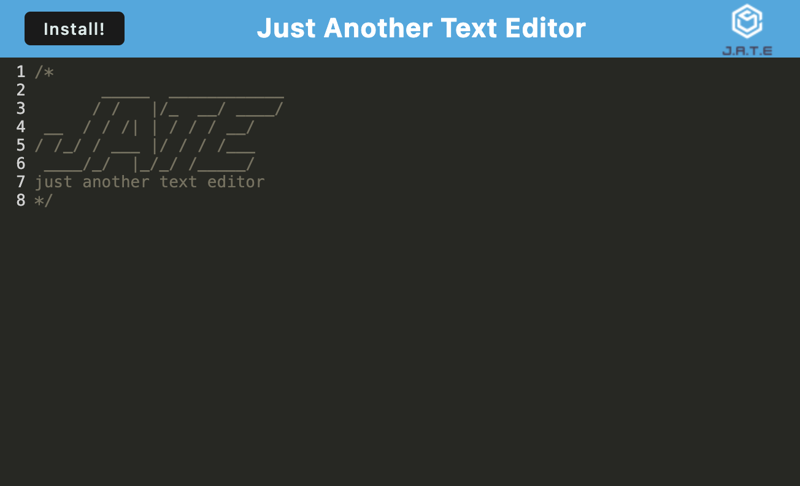

# Text Editor - JATE (Just Another Text Editor)

## Description

A Progressive Web Application (PWA) text editor program that runs in the browser.

This program was created to allow the user to use the text editor within the browser but also to download the program for offline use. While working on this project I learned about PWAs, service workers, webpack plugins, manifest files, IndexedDB, precaching and how to deploy to Render.

### User Story

AS A developer
- I WANT to create notes or code snippets with or without an internet connection
- SO THAT I can reliably retrieve them for later use 

### Acceptance Criteria

GIVEN a text editor web application
- WHEN I open my application in my editor
- THEN I should see a client server folder structure
- WHEN I run `npm run start` from the root directory
- THEN I find that my application should start up the backend and serve the client
- WHEN I run the text editor application from my terminal
- THEN I find that my JavaScript files have been bundled using webpack
- WHEN I run my webpack plugins
- THEN I find that I have a generated HTML file, service worker, and a manifest file
- WHEN I use next-gen JavaScript in my application
- THEN I find that the text editor still functions in the browser without errors
- WHEN I open the text editor
- THEN I find that IndexedDB has immediately created a database storage
- WHEN I enter content and subsequently click off of the DOM window
- THEN I find that the content in the text editor has been saved with IndexedDB
- WHEN I reopen the text editor after closing it
- THEN I find that the content in the text editor has been retrieved from our IndexedDB
- WHEN I click on the Install button
- THEN I download my web application as an icon on my desktop
- WHEN I load my web application
- THEN I should have a registered service worker using workbox
- WHEN I register a service worker
- THEN I should have my static assets pre cached upon loading along with subsequent pages and static assets
- WHEN I deploy to Render
- THEN I should have proper build scripts for a webpack application

## Table of Contents

- [Installation](#installation)
- [Usage](#usage)
- [Credits](#credits)
- [License](#license)

## Installation

To install this program visit the deployed webpage and click the Install button.

## Usage

1. Visit the deployed link.
2. Use the text editor in the browser
3. Install the program by clicking the Install button

GitHub Repo: https://github.com/ahgeak/text_editor_progressive_web_app  
Deployed Link: https://text-editor-progressive-web-app.onrender.com 

Screenshot of Program:

## Credits

I worked on this project alone without other collaborators. While working on the code I referenced the documentation and class exercises.

## License

This project uses an MIT license.
